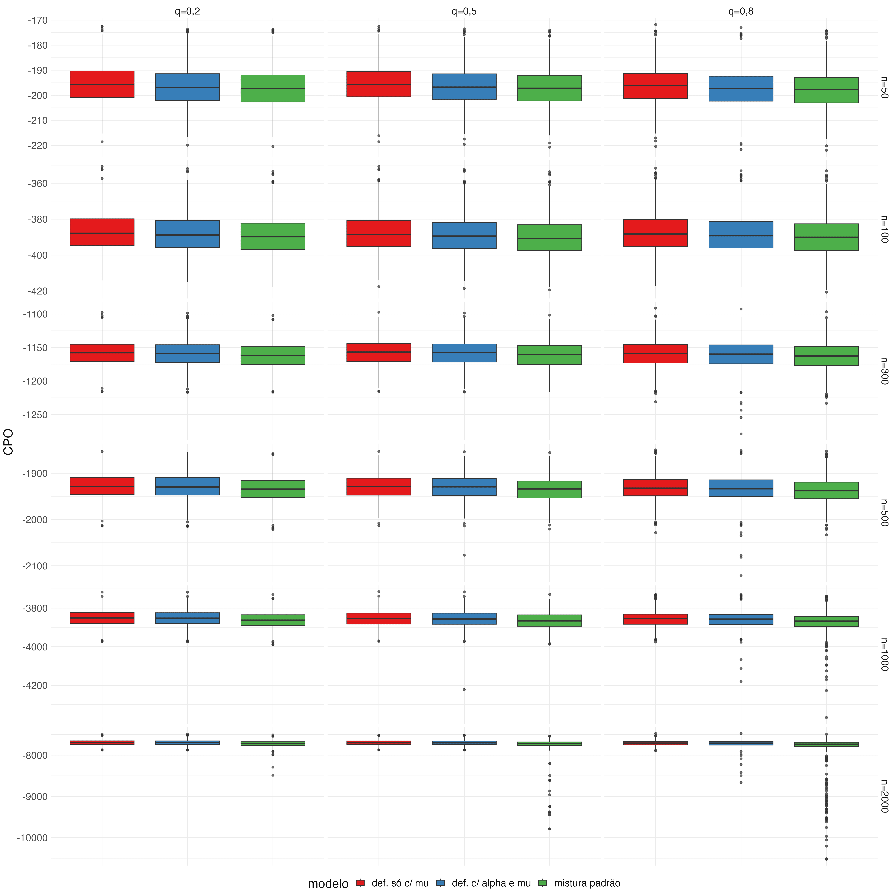
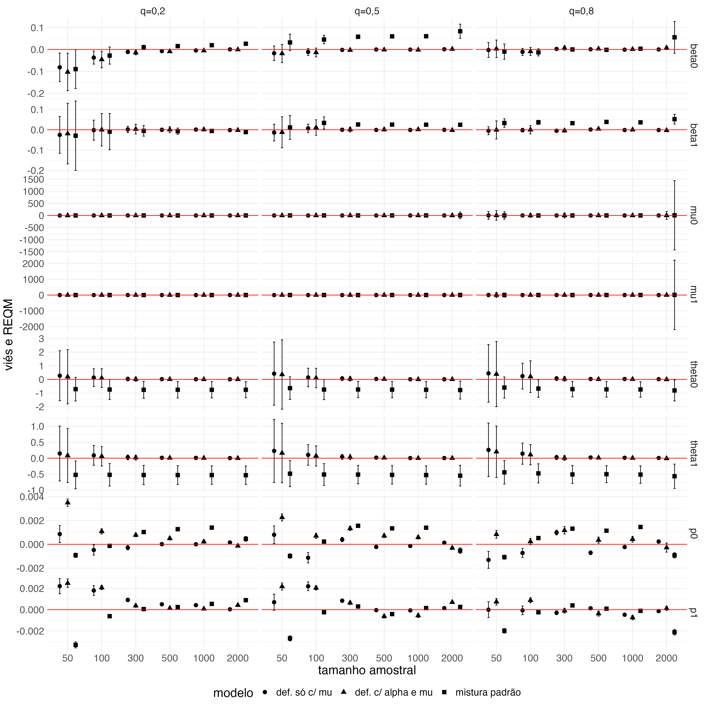
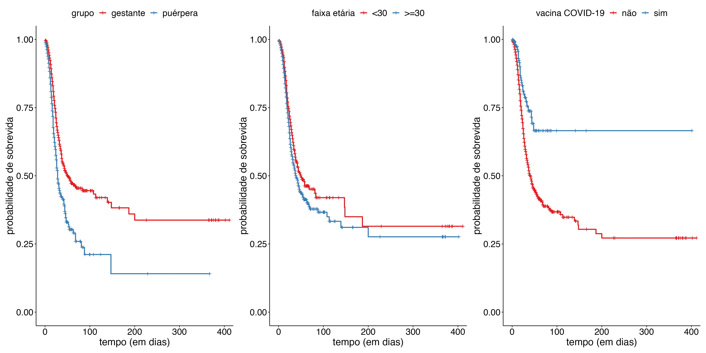
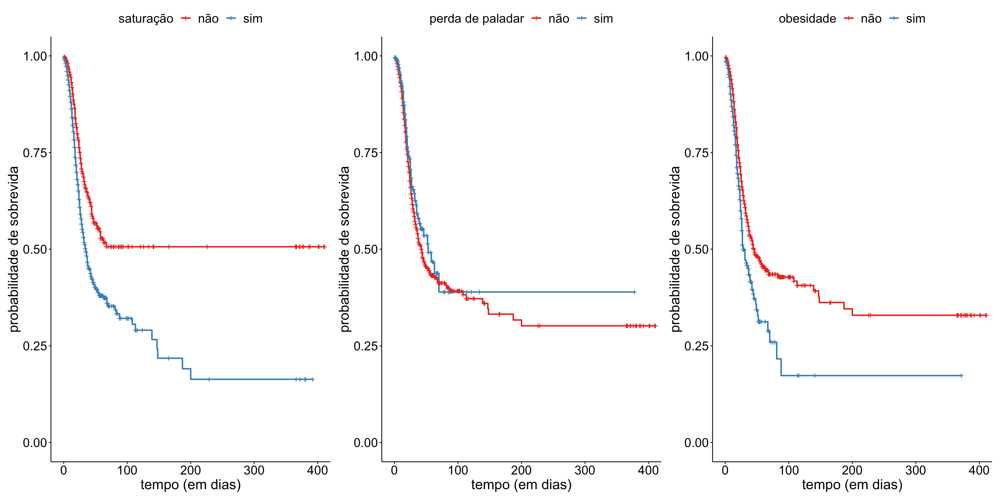
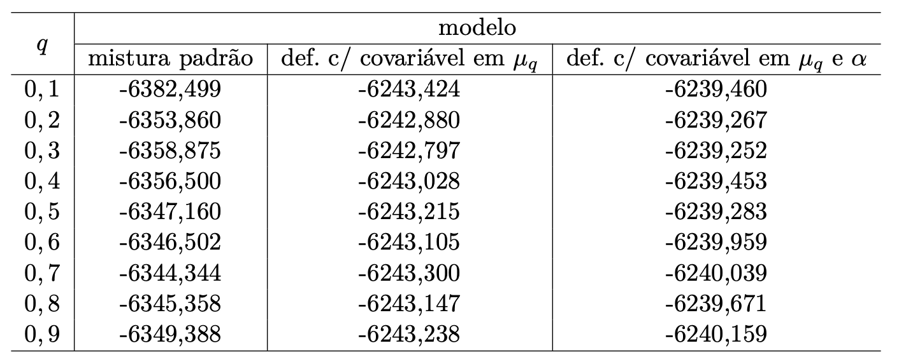
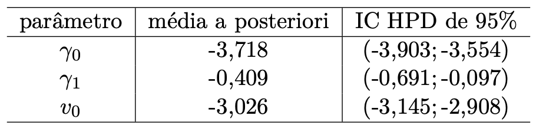
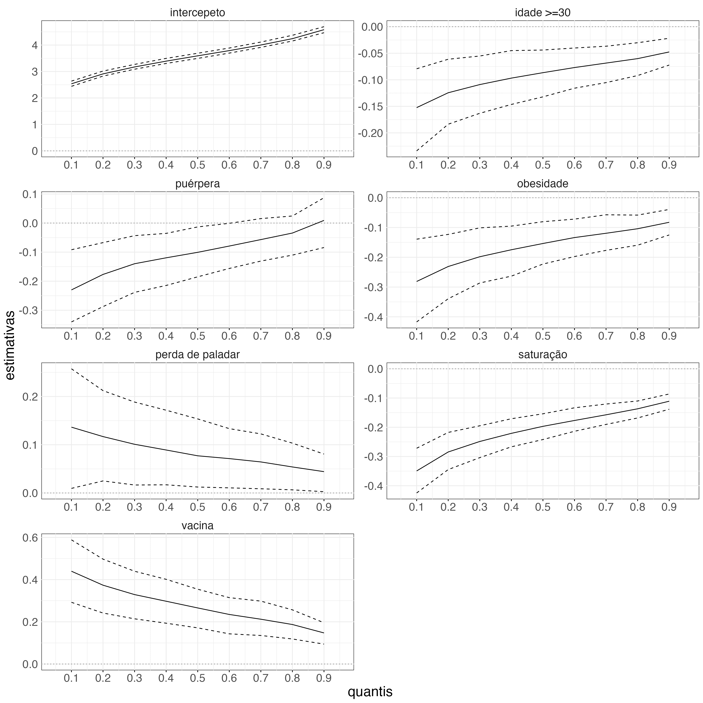
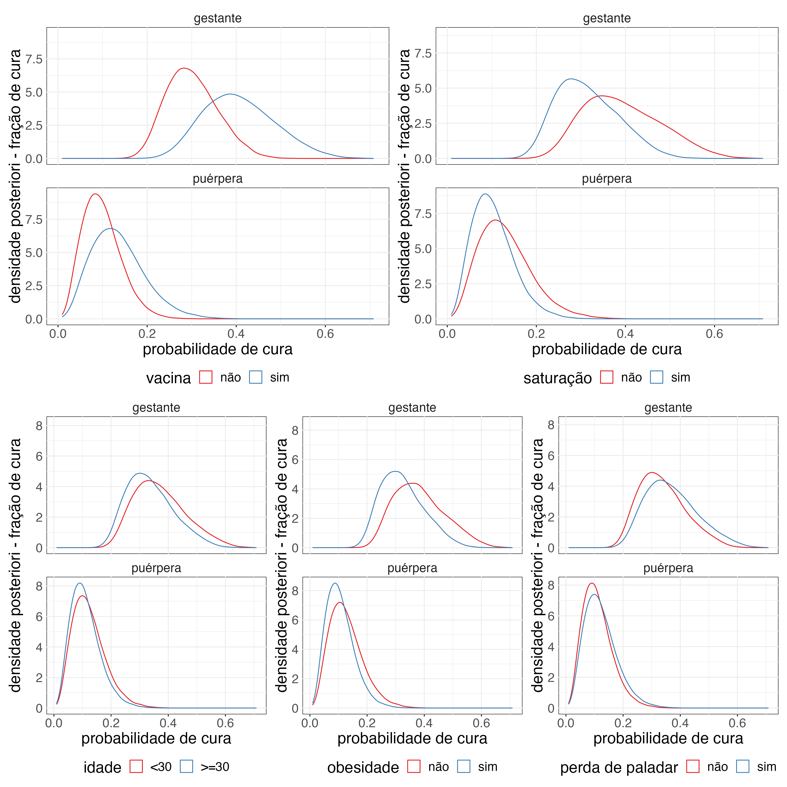

class: inverse, middle

## Modelo de regressão quantílica com fração de cura: uma aplicação aos dados de COVID-19 grave na população materna

.large[#### Monografia II - 2022/2 
Orientadora: Agatha Sacramento Rodrigues | Coorientador: Patrick Borges]

*****

### Ornella Scardua Ferreira

---
class: middle, inverse

```{r setup, include=FALSE}
options(htmltools.dir.version = FALSE)

knitr::opts_chunk$set(
  fig.width=9, fig.height=3.5, fig.retina=3,
  out.width = "100%",
  cache = FALSE,
  echo = TRUE,
  message = FALSE, 
  warning = FALSE,
  hiline = TRUE
)
```

```{r xaringan-themer, include=FALSE, warning=FALSE}
library(xaringanthemer)
style_mono_accent(
  base_color = "#0A1E3C",
  code_inline_color = "#41BE3C",
  text_bold_color = "#32A0FF",
  link_color = "#FAC80F",
  text_font_google = google_font("Lato", "300", "300i"),
  header_font_google = google_font("Ubuntu")
)
```

```{css, echo=FALSE}
pre {
  max-height: 300px;
  overflow-y: auto;
  background-color: inherit;
}
```

## Introdução

---

### Contexto

- Na Análise de Sobrevivência, o principal objetivo consiste em investigar o impacto de covariáveis no tempo até a ocorrência do evento de interesse. O tempo é denominado tempo de falha.

- Modelos de taxas de falha proporcionais **(Cox, 1972)** e de taxa de falha acelerada **(Prentice, 1978)** fazem inferências em termos das taxas de falha ou da média do logaritmo dos tempos de falha, respectivamente, e assumem que todo indivíduo "irá falhar". 

- Entretanto, boa parte dos indivíduos pode ser curada ou estar imune ao evento de interesse.

- Modelos de sobrevivência que consideram uma fração de cura têm sido constantemente usados. São conhecidos como modelos de fração de cura ou modelos de sobrevivência de longo prazo.

- A abordagem mais comum para modelos de fração de cura são os modelos de mistura padrão **(Boag, 1949; Berkson and Gage, 1952)** e os modelos baseados em distribuições defeituosas **(Balka, Desmond e McNicholas, 2009)**.

---

- Modelos de mistura padrão consideram um parâmetro exclusivo para a fração de cura, enquanto os modelos defeituosos não incluem um parâmetro extra para a fração de cura.

- Há o interesse em avaliar como os coeficientes de regressão das covariáveis mudam para diferentes quantis de tempo de sobrevivência. Porém, modelos defeituosos e de mistura padrão não abordam a estimativa da função quantílica.

- Modelos de regressão quantílica com fração de cura semi-paramétricos foram propostos por **Wu e Yin (2017)**, **Gupta et al. (2016)** e **Narisetty e Koenker (2022)**, enquanto **Rodrigues, Borges e Santos (2021)** e **Velten (2021)** propuseram modelos de regressão quantílica totalmente paramétricos.

- Modelos de regressão quantílica que envolvem a fração de cura estimam os efeitos das covariáveis no quantis dos tempos de sobrevivência dos indivíduos sujeitos à falha e na fração de cura.

---

### Motivação

Trabalho de **Rodrigues, Borges e Santos (2021)**. Afinal, modelos defeituosos sobrecarregam seus parâmetros ao concentrarem informações dos suscetíveis e insuscetíveis ao mesmo tempo?

### Objetivos

- Desenvolver o modelo de regressão quantílica de mistura padrão com distribuição Gompertz generalizada para o tempo de vida dos suscetíveis. 

- Por meio de estudos de simulação de Monte Carlo, comparar o modelo de mistura padrão com o modelo de regressão quantílica defeituoso com distribuição Gompertz generalizada de **Rodrigues, Borges e Santos (2021)** a fim de avaliar se os parâmetros do modelo defeituoso ficam sobrecarregados ao estimar, simultaneamente, a fração de cura e os parâmetros do tempo de vida dos suscetíveis.

- Aplicar os modelos estudados aos dados de gestantes e puérperas internadas com Síndrome Respiratória Aguda Grave (SRAG) por COVID-19.

---
class: middle, inverse

## Metodologia

---

### Distribuição Gompertz generalizada (GG)

- Introduzida por **El-Gohary et al. (2013)**.

- Função densidade: 
\begin{equation}
\label{eq-1}
f(t\mid \lambda,\alpha,\theta)=\lambda\theta\exp\left\{\alpha t-\frac{\lambda}{\alpha}\left(\exp\{\alpha t\}-1\right)\right\}\left(1-\exp\left\{-\frac{\lambda}{\alpha}\left(\exp\{\alpha t\}-1\right)\right\}\right)^{\theta-1}.
\end{equation}

- Função de sobrevivência:
\begin{equation}
\label{eq-2}
S(t\mid \lambda,\alpha,\theta)=1-\left(1-\exp\left\{-\frac{\lambda}{\alpha}\left(\exp\{\alpha t\}-1\right)\right\}\right)^\theta\mbox{,}
\end{equation}
em que $\lambda,\alpha>0$ são os parâmetros de escala e $\theta>0$ é o parâmetro de forma e $t>0$.

> casos especiais: (i) distribuição exponencial generalizada quando $\alpha$ vai para zero; (ii) distribuição Gompertz quando $\theta = 1$; e (iii) distribuição exponencial quando $\alpha$ vai para zero e $\theta = 1$. 
---

- Função de risco: 
\begin{equation*}
\label{eq-4}
h(t\mid\lambda,\alpha,\theta)=\frac{\lambda\theta\exp\{\alpha t-\frac{\lambda}{\alpha}\left(\exp\{\alpha t\}-1\right)\}\left(1-\exp\{-\frac{\lambda}{\alpha}\left(\exp\{\alpha t\}-1\right)\}\right)^{\theta-1}}{1-\left(1-\exp\{-\frac{\lambda}{\alpha}\left(\exp\{\alpha t\}-1\right)\}\right)^\theta}.
\end{equation*}

> forma funcional: (i) crescente se $\alpha>0$ e $\theta=1$; (ii) constante se $\alpha=0$ e $\theta=1$; (iii) crescente quando $\theta>1$; (iv) decrescente quando $\alpha=0$ e $\theta<1$; e (v) banheira $\alpha>0$ e $\theta<1$. 

- Função quantílica:
\begin{equation}
\label{eq-3}
\mu_q=\mu(q\mid\lambda,\alpha,\theta)=\frac{1}{\alpha} \log\left(1 - \frac{\alpha}{\lambda} \log\left(1 - q^{1/\theta} \right) \right), 0<q<1.
\end{equation}

- O parâmetro $\theta$ é obtido ao isolá-lo na função quantílica:
\begin{equation}
\label{eq-theta}
\theta=\frac{\log(q)}{\log\left\{1-\exp\left[-\frac{\lambda}{\alpha}\left(e^{\alpha \mu_{q}}-1\right)\right]\right\}}.
\end{equation}

---

### Modelo de mistura padrão

- Ajusta a mistura de duas distribuições: uma representa o tempo de falha dos suscetíveis e a outra, a fração de cura.

- Atribui uma variável latente Bernoulli $Z$ com probabilidade de sucesso $P(Z = 1) = 1 - p_0$ e probabilidade de fracasso $P(Z = 0) = p_0$ para cada observação.

- Função de sobrevivência:
\begin{eqnarray*}
\label{eq-new}
S_{MP}(t)&=& P(T \geq t) = \sum_{z=0}^1P(T \geq t, Z=z) = P(T \geq t, Z=0) + P(T \geq t, Z=1) \nonumber \\
&=& P(T \geq t\mid Z=0)P(Z=0)+ P(T \geq t\mid Z=1)P(Z=1) \nonumber \\
&=&
p_{0}+\big(1-p_{0}\big)S_{1}(t)\mbox{,}
\end{eqnarray*}
em que $S_1(\cdot)$ denota a função de sobrevivência dos indivíduos suscetíveis ao evento de interesse. 

> se $p_0=0$, então $S_{MP}(t)=S(t)$; $S_{MP}(0)=1$; $\lim_{t\rightarrow\infty}S_{MP}(t)=p_0$.

---

- Função densidade: 
\begin{eqnarray*}
\label{eq-density-function}
f(t)&=& \big(1-p_{0}\big)f_{1}(t),
\end{eqnarray*}
em que $f_1(\cdot)$ é a função densidade dos indivíduos suscetíveis à falha.

- O modelo de regressão é construído impondo que o quantil $\mu_{q}$ de $T$ satisfaça a seguinte relação funcional:
\begin{equation*}
%\label{reg_mu}
\mu_{q}(\boldsymbol{\beta},\textbf{x})= \mu_{q} =\exp(\textbf{x}^{\top}\boldsymbol{\beta}_q) \nonumber,
\end{equation*}
em que $\textbf{x}^{\top}=(1,x_{1},\ldots,x_{p})$ é o vetor de covariáveis e $\boldsymbol{\beta}_q=(\beta_{q0},\beta_{q1},\ldots,\beta_{qp})^{\top}$ é o vetor de parâmetros da regressão a serem estimados. 

- Assume-se que a fração de cura $p_0$ pode ser relacionada a um vetor de $r$ covariáveis, $\textbf{z}^{\top}=(1,z_{1},\ldots,z_{r})$, por meio de uma função logito
\begin{equation}
\label{p0_mix}
p_0(\boldsymbol{\gamma},\textbf{z})=p_0=\exp\{\textbf{z}^{\top}\boldsymbol{\gamma}\}/(1+\exp\{\textbf{z}^{\top}\boldsymbol{\gamma}\}) ,
\end{equation}
em que $\boldsymbol{\gamma}=(\gamma_{0},\gamma_1,\ldots,\gamma_{r})^{\top}$ é o vetor de parâmetros da regressão também a serem estimados.

- Os vetores das covariáveis $\textbf{x}$ e $\textbf{z}$ podem ser os mesmos, ou seja,
$\textbf{x}=\textbf{z}$.

- $\boldsymbol{\vartheta}_q=(\boldsymbol{\beta}^{\top}_q,\boldsymbol{\gamma}^{\top},\lambda,\alpha)^{\top}$ é o vetor de parâmetros a ser estimado.

---

- Função densidade reparametrizada:
\begin{eqnarray}
f(t\mid\boldsymbol{\vartheta}_q,{\textbf x},{\textbf z}) &=& \left(1-\frac{\exp\{\textbf{z}^{\top}\boldsymbol{\gamma}\}}{1+\exp\{\textbf{z}^{\top}\boldsymbol{\gamma}\}} \right) \times \lambda \left[\frac{\log(q)}{\log\left\{1-\exp\left[-\frac{\lambda}{\alpha}\left(e^{\alpha \exp(\textbf{x}^{\top}\boldsymbol{\beta}_q)}-1\right)\right]\right\}}\right] \\ \nonumber && \times \exp\left\{\alpha t-\frac{\lambda}{\alpha}(\exp\{\alpha t\}-1)\right\} \\  \nonumber && \times \left(1-\exp\left\{-\frac{\lambda}{\alpha}(\exp\{\alpha t\}-1)\right\}\right)^{\frac{\log(q)}{\log\left\{1-\exp\left[-\frac{\lambda}{\alpha}\left(e^{\alpha \exp(\textbf{x}^{\top}\boldsymbol{\beta}_q)}-1\right)\right]\right\}}-1}, t>0, \label{densidade_mp}
\end{eqnarray}

- Função de sobrevivência reparametrizada:
\begin{eqnarray}
S(t\mid \boldsymbol{\vartheta}_q,{\bf x},{\bf z}) &=& \frac{\exp\{\textbf{z}^{\top}\boldsymbol{\gamma}\}}{1+\exp\{\textbf{z}^{\top}\boldsymbol{\gamma}\}}+\left(1-\frac{\exp\{\textbf{z}^{\top}\boldsymbol{\gamma}\}}{1+\exp\{\textbf{z}^{\top}\boldsymbol{\gamma}\}} \right) \\  \nonumber && \times \left[1 - \left(1-\exp\left\{\ -\frac{\lambda}{\alpha}(\exp\{\alpha t\}-1)\right\}\right)\\^{\frac{\log(q)}{\log\left\{1-\exp\left[-\frac{\lambda}{\alpha}\left(e^{\alpha \exp(\textbf{x}^{\top}\boldsymbol{\beta}_q)}-1\right)\right]\right\}}-1}\right], \quad t >0. \label{sobrev_mp}
\end{eqnarray}

---

### Modelo defeituoso

- As principais distribuições são a Gaussiana Inversa e a Gompertz.

- São obtidas ao mudar o espaço paramétrico de um dos parâmetros de tal forma que o limite da função de sobrevivência converge para um valor limitado no intervalo $(0,1)$ quando o tempo vai para infinito.

- Não há necessidade de assumir a existência de uma fração de curados antes de modelar.

- Vantagem: permite estimar a fração de cura sem incluir um parâmetro extra no modelo.

> problema: pode sofrer com a sobrecarga nos parâmetros da distribuição.

- Desvantagem: a função quantílica não é bem definida, pois a distribuição é defeituosa. 

> solução: pode ser reescrito como um modelo de mistura padrão.

---

- Um modelo de regressão quantílica considerando a distribuição GG em uma versão defeituosa foi proposto por **Rodrigues, Borges e Santos (2021)**.

- A distribuição GG se torna uma distribuição defeituosa se $\alpha<0$. Assim, a fração de cura é dada por:
\begin{equation}
\label{eq-5}
\lim_{t\rightarrow\infty}S(t\mid\lambda,\alpha,\theta)=1-\left(1-\exp\Bigg\{\frac{\lambda}{\alpha}\Bigg\}\right)^\theta=p_{0}(\lambda,\alpha,\theta)\in[0,1].
\end{equation}

- Uma variável indicadora $Y$ assume valor 0 se o indivíduo é imune e 1 se o indivíduo é suscetível, isto é, $\mathbb{P}[Y=0]=p_{0}(\lambda,\alpha,\theta)$ e $\mathbb{P}[Y=1]=1-p_{0}(\lambda,\alpha,\theta)$.

- Função de sobrevivência defeituosa:
\begin{eqnarray}
\label{eq-sobrev_defeit}
S(t\mid\lambda,\alpha,\theta)= p_{0}(\lambda,\alpha,\theta)+\big[1-p_{0}(\lambda,\alpha,\theta)\big]S_{2}(t\mid\lambda,\alpha,\theta)\mbox{,}
\end{eqnarray}
em que $S_2(\cdot)$ denota a função de sobreviência dos suscetíveis.

- A partir da função de sobrevivência defeituosa, uma expressão para $S_{2}$ é:
\begin{equation}
\label{eq-s1}
S_{2}(t\mid\lambda,\alpha,\theta)=\frac{S(t\mid\lambda,\alpha,\theta)-p_{0}(\lambda,\alpha,\theta)}{1-p_{0}(\lambda,\alpha,\theta)}.
\end{equation}

---

- $S_{2}$ é uma função de sobrevivência própria com função quantílica dada por:
\begin{equation}
\label{eq-tq1}
\mu^{1}_{q}=\mu^{1}(q\mid\lambda,\alpha,\theta)=\frac{\log\left(\lambda-\alpha\log\left(1-q^{\frac{1}{\theta}}\left(1-\exp\{\frac{\lambda}{\alpha}\}\right)\right)\right)-\log(\lambda)}{\alpha}, 0<q<1.
\end{equation}

- O parâmetro $\theta$ é obtido ao isolá-lo na função quantílica:
\begin{equation}
\theta=-\frac{\log(q)}{\log\left(1-\exp\{ \frac{\lambda}{\alpha} \}\right)-\log\left(1-\exp\left\{ -\frac{\lambda}{\alpha}\left(e^{\alpha \mu_{q}^{1}}-1\right) \right\}\right)}.
\end{equation}

- Função densidade reparametrizada:
\begin{eqnarray}
\label{density_repar}
f(t\mid\lambda,\alpha,\mu_{q}^{1}) &=& \lambda\left[-\frac{\log(q)}{\log\left(1-\exp\{\frac{\lambda}{\alpha}\}\right)-\log\left(1-\exp\left\{-\frac{\lambda}{\alpha}\left(e^{\alpha \mu_{q}^{1}}-1\right)\right\}\right)}\right] \nonumber \\ 
&& \times \exp\{\alpha t-\frac{\lambda}{\alpha}\left(\exp\{\alpha t\}-1\right)\}\nonumber\\
&&\times\left(1-\exp\big\{-\frac{\lambda}{\alpha}\left(\exp\{\alpha t\}-1\right)\big\}\right)^{-\frac{\log(q)}{\log\left(1-\exp\{\frac{\lambda}{\alpha}\}\right)-\log\left(1-\exp\left\{-\frac{\lambda}{\alpha}\left(e^{\alpha \mu_{q}^{1}}-1\right)\right\}\right)}-1}.
\end{eqnarray}

---

- Função de sobrevivência reparametrizada:
\begin{equation}
\label{survival_repar}
S(t\mid\lambda,\alpha,\mu_{q}^{1})=1-\left(1-\exp\big\{-\frac{\lambda}{\alpha}\left(\exp\{\alpha t\}-1\right)\big\}\right)^{-\frac{\log(q)}{\log\left(1-\exp\{\frac{\lambda}{\alpha}\}\right)-\log\left(1-\exp\left\{-\frac{\lambda}{\alpha}\left(e^{\alpha \mu_{q}^{1}}-1\right)\right\}\right)}}.
\end{equation}

- Fração de cura:
\begin{equation}
\label{cure_repar}
p_{0}(\lambda,\alpha,\mu_{q}^{1})=1-\left(1-\exp\Bigg\{\frac{\lambda}{\alpha}\Bigg\}\right)^{-\frac{\log(q)}{\log\left(1-\exp\{\frac{\lambda}{\alpha}\}\right)-\log\left(1-\exp\left\{-\frac{\lambda}{\alpha}\left(e^{\alpha \mu_{q}^{1}}-1\right)\right\}\right)}}.
\end{equation}

- O modelo de regressão é construído impondo que o quantil $\mu_{q}^{1}$ de $T$ satisfaça a seguinte relação funcional:
\begin{equation*}
%\label{reg_mu}
\mu_{q}^{1}(\boldsymbol{\beta}_q,\textbf{x})= \mu_{q}^{1} =\exp(\textbf{x}^{\top}\boldsymbol{\beta}_q) \nonumber,
\end{equation*}
em que $\textbf{x}^{\top}=(1,x_{1},\ldots,x_{p})$ é o vetor de covariáveis e $\boldsymbol{\beta}_q=(\beta_{q0 },\beta_{q1},\ldots,\beta_{qp})^{\top}$ é o vetor desconhecido dos parâmetros de regressão a serem estimados.

- Os parâmetros $\alpha$ e $\lambda$ também podem ser ligados a covariáveis.

---

- Para $\alpha$, a relação funcional é dada por
\begin{equation}
\label{eq-alpha}
\log(-\alpha)=\textbf{w}^{\top}\boldsymbol{\gamma},
\end{equation}
em que $\textbf{w}^{\top}=(1,w_{1},\ldots,w_{r})$ são os vetores de covariáveis e $\boldsymbol{\gamma}=(\gamma_{0 },\gamma_{1},\ldots,\gamma_{r})^{\top}$ é o vetor desconhecido dos parâmetros de regressão.

- Para $\lambda$, temos que
\begin{equation*}
\lambda= \exp(\textbf{z}^{\top}\boldsymbol{v}) \nonumber,
\end{equation*}
em que $\textbf{z}^{\top}=(1,z_{1},\ldots,z_{s})$ são os vetores de covariáveis e $\boldsymbol{v}=(v_{0 },v_{1},\ldots,v_{s})^{\top}$ é o vetor desconhecido dos parâmetros de regressão.

- $\boldsymbol{\vartheta}_q^1=(\boldsymbol{\beta}_q^{\top}, \boldsymbol{\gamma}^{\top},\boldsymbol{v}^{\top})^{\top}$ é o vetor dos parâmetros a ser estimado.

---

## Inferência

- Suponha que o tempo de vida $T$ pode não ser observado, isto é, ele é limitado por um tempo de falha censurado à direita, e seja $C$ o tempo de censura. 

- Em uma amostra de tamanho $n$, observa-se o $i$-ésimo tempo de vida $t_{i}=\min(T_i,C_i)$, e $i$-ésimo indicador de falha $\delta_i=I(T_i\leq C_i)$, onde $\delta_i=1$ se $T_i$ for observado e $\delta_i=0$ caso contrário, para $i=1,\ldots,n$.

- Assume-se que cada tempo de censura $C_i$ é independente do tempo de vida $T_i$ e consideramos a suposição de censura não informativa. 

- No modelo de mistura padrão, a função de verossimilhança de $\boldsymbol{\vartheta}_q$ é:
\begin{eqnarray*}
L(\boldsymbol{\vartheta}_q;{\bf D})&\propto&\prod_{i=1}^{n}\left[f \left( t_i\mid \boldsymbol{\vartheta}_q,{\bf x}_i, {\bf z}_i \right)\right]^{\delta_i}\left[S \left( t_i\mid \boldsymbol{\vartheta}_q,{\bf x}_i, {\bf z}_i \right)\right]^{1-\delta_i}.
\end{eqnarray*}

- No modelo defeituoso, a função de verossimilhança de $\boldsymbol{\vartheta}_q^1$ é:
\begin{eqnarray*}
L(\boldsymbol{\vartheta}_q^1;{\bf D})&\propto&\prod_{i=1}^{n}\left[f \left( t_i\mid \boldsymbol{\vartheta}_q^1,{\bf x}_i,{\bf z}_i\right)\right]^{\delta_i}\left[S \left( t_i\mid \boldsymbol{\vartheta}_q^1,{\bf x}_i, {\bf z}_i\right)\right]^{1-\delta_i}.
\end{eqnarray*}

---

- O processo inferencial será feito sob o paradigma bayesiano. 

- No modelo de mistura padrão, a distribuição a posteriori é dada por: 
\begin{equation*}
\pi(\boldsymbol{\vartheta}_q\mid {\bf D})\propto \pi(\boldsymbol{\vartheta}_q)L(\boldsymbol{\vartheta}_q;{\bf D}).
\end{equation*}

> para as distribuições a priori de $\boldsymbol{\vartheta}_q$: assumiu-se distribuição Gama com média $1$ e variância $100$ para $\alpha$ e $\lambda$; e distribuição Normal com média $0$ e variância $100$ para cada $\beta$ e para cada $\gamma$.

- No modelo defeituoso, a distribuição a posteriori é dada por: 
\begin{equation*}
\pi(\boldsymbol{\vartheta}_q^1\mid {\bf D})\propto \pi(\boldsymbol{\vartheta}_q^1)L(\boldsymbol{\vartheta}_q^1;{\bf D}).
\end{equation*}

> para as distribuições a priori de $\boldsymbol{\vartheta}^1_q$: assumiu-se distribuição Normal com média $0$ e variância $100$ para cada $\beta_{qj}$, $\gamma_{k}$ e $v_{l}$, com $j=0,1,\ldots, p$, $k=0,1,\ldots, r$ e $l=0,1,\ldots, s$.

- As distribuições a priori de $\boldsymbol{\vartheta}_q$ e $\boldsymbol{\vartheta}^1_q$ têm que ser independentes.

- A distribuição a posteriori não tem forma fechada, então os parâmetros serão estimados por Monte Carlo via Cadeias de Markov (MCMC).

---

- Obteremos uma amostra de tamanho $M$ da distribuição a posteriori conjunta de $\boldsymbol{\vartheta}^1_q$, i.e., $\left(\boldsymbol{\vartheta}^1{}_{q}^{(1)}, \boldsymbol{\vartheta}^1{}_{q}^{(2)}, \ldots, \boldsymbol{\vartheta}^1{}_{q}^{(M)}\right)$, $\boldsymbol{\vartheta}^1_q$ o vetor de parâmetros do modelo defeituoso.

- Similarmente, obteremos $\boldsymbol{\vartheta}_q = \left(\boldsymbol{\vartheta}_{q}^{(1)}, \boldsymbol{\vartheta}_{q}^{(2)}, \ldots, \boldsymbol{\vartheta}_{q}^{(M)}\right)$, $\boldsymbol{\vartheta}_q$ o vetor de parâmetros do modelo de mistura padrão.

- A média a posteriori de $\boldsymbol{\vartheta}^1_{q}$ pode ser aproximada por
\begin{equation*}
\widehat{\boldsymbol{\vartheta}^1}{}_{q}=\frac{1}{M} \sum_{m=1}^{M} \boldsymbol{\vartheta}^{1}{}_{q}^{(m)},  
\end{equation*}

- A média a posteriori da fração de cura definida para o modelo defeituoso é estimada por
\begin{equation*}
\widehat{p}_{0}=\frac{1}{M}\sum_{m=1}^{M}1-\left(1-\exp\Bigg\{\frac{\lambda^{(m)}}{\alpha^{(m)}}\Bigg\}\right)^{-\frac{\log(q)}{\log\left(1-\exp\left\{\frac{\lambda^{(m)}}{\alpha^{(m)}}\right\}\right)-\log\left(1-\exp\left\{-\frac{\lambda^{(m)}}{\alpha^{(m)}}\left(e^{\alpha^{(m)} \mu_{q}^{(m)}}-1\right)\right\}\right)}}.
\end{equation*}

- Utilizamos o Critério da Densidade Preditiva Ordenada (CPO - abreviatura em inglês para _Conditional Predictive Ordinate_) **(Gelfand; Smith; Lee, 1992)** para comparar os modelos e selecionar o que melhor se ajustou aos dados.

> quanto maior o valor de CPO, melhor é o ajuste do modelo.

<!-- \begin{equation*} -->
<!-- CPO_{i}=\int_{\Theta_{q}} f\left(t_{i} \mid \boldsymbol{\vartheta}^1_{q}\right) \pi\left(\boldsymbol{\vartheta}^1_{q} \mid \mathbf{D}_{-i}\right) d \boldsymbol{\vartheta}^1_{q}=\left\{\int_{\Theta_{q}} \frac{\pi\left(\boldsymbol{\vartheta}^1_{q} \mid \mathbf{D}\right)}{f\left(t_{i} \mid \boldsymbol{\vartheta}^1_{q}\right)} d \boldsymbol{\vartheta}^1_{q}\right\}^{-1}, -->
<!-- \end{equation*} -->
<!-- em que $\Theta_{q}$ é o espaço paramétrico de $\boldsymbol{\vartheta}^1_{q}$. -->

<!-- - De acordo com **Gilks, Richardson e Spiegelhalter (1995)**, o $CPO_{i}$ pode ser estimado considerando os $M$ valores da distribuição a posteriori de $\vartheta_{q}^1$, isto é, -->
<!-- \begin{equation*} -->
<!-- \widehat{CPO}_{i}=\left\{\frac{1}{M} \sum_{m=1}^{M} \frac{1}{g\left(t_{i} \mid \boldsymbol{\vartheta}^1{}_{q}^{(m)}\right)}\right\}^{-1}, -->
<!-- \end{equation*} -->
<!-- sendo que $g\left(t_{i} \mid \boldsymbol{\vartheta}^1{}_{q}^{(m)}\right)$ = $f\left(t_{i} \mid \boldsymbol{\vartheta}^1{}_{q}^{(m)}\right)$ se $\delta_{i}=1$ e $S\left(t_{i} \mid \boldsymbol{\vartheta}^1{}_{q}^{(m)}\right)$ se $\delta_{i}=0$, $i=1, \ldots, n$. -->

<!-- - A medida LPML ( _Log Pseudo Marginal Likelihood_) é a soma dos logaritmos dos CPOs de todas as observações, ou seja, $$LPML=\sum_{i=1}^n\log(\widehat{CPO}_i).$$ -->

<!-- > quanto maior o valor de LPML, melhor é o ajuste do modelo. -->

---
class: middle, inverse

## Estudo de simulação

---

### Objetivos

- Utilizar simulação de Monte Carlo para comparar os modelos:

    - de mistura padrão;
    - defeituoso com covariável ligada somente à função quantílica $\mu^1_q$; e
    - defeituoso com covariável associada aos parâmetros $\mu^1_q$ e $\alpha$.
    
- Avaliar o desempenho em termos do viés, raiz do erro quadrático médio (REQM) e CPO.

- Verificar se os parâmetros dos modelos defeituosos ficam sobrecarregados ao estimar ao mesmo tempo a fração de cura e os parâmetros do tempo de vida dos suscetíveis.

---

### Procedimentos

- Os dados foram gerados a partir do modelo com distribuição Gompertz generalizada defeituosa.

- Consideramos no cenário de simulação:

    - $q\in\{0,2;~ 0,5; ~ 0,8\}$;
    - $n=50; ~ 100; ~ 300; ~ 500; ~ 1.000; ~ 2.000$;
    - 27% de censura à direita;
    - frações de cura: $p_{00}=0,26$ e $p_{01}=0,20$;
    - verdadeiros valores dos parâmetros:
        - $q=0,2$: $\alpha=-\exp(-3,77);\lambda=\exp(-2,99);\beta_0=2,71;\beta_1=-0,33;$
        - $q=0,5$: $\alpha=-\exp(-3,77);\lambda=\exp(-2;99);\beta_0=3,45;\beta_1=-0,23;$
        - $q=0,8$: $\alpha=-\exp(-3,77);\lambda=\exp(-2,99);\beta_0=4,14;\beta_1=-0,16.$
    
- As amostras _burn-in_ e de salto dos modelos defeituosos e de mistura padrão foram descartadas, resultando em $M=1.000$ amostras da posteriori.

> 100.000 amostras burn-in no modelo de mistura padrão e 200.000 amostras burn-in no modelo defeituoso; foram consideradas amostras de saltos de tamanho 100 em ambos os modelos.
    
- $B=1.000$ conjuntos de dados foram gerados.

---

#### CPO

```{r echo = FALSE, message = FALSE, fig.align = 'center', out.width = '70%'}

```

---

#### Viés e REQM

```{r echo = FALSE, message = FALSE, fig.align = 'center', out.width = '70%'}

```

---
class: middle, inverse

## Aplicação

---

### Objetivos

- Avaliar o impacto do período obstétrico, vacina COVID-19, entre outros fatores prognósticos nos diferentes quantis do tempo de sobrevida de gestantes e puérperas internadas com SRAG por COVID-19.

- Estimar a fração de cura.

### Dados

- Coletados da base de dados do Sistema de Informação da Vigilância Epidemiológica da Gripe (SIVEP-Gripe), sistema oficial para o registro dos casos e óbitos por Síndrome Respiratória Aguda Grave (SRAG) no Brasil.

- $n = 9.936$ registros de gestantes e puérperas de 10 a 55 anos hospitalizadas com SRAG por COVID-19, confirmada por teste de RT-PCR, datados de março de 2020 até março de 2022.

- O óbito pela doença de COVID-19 foi considerado como evento de interesse.

> 1.198 (12%) tempos de falha e 8.738 (88%) censuras à direita.

---

- 3 variáveis de **caracterização**: grupo (gestante ou puérpera), faixa etária (<30 e $\leq$ 30) e vacina contra a COVID-19; 2 variáveis de **sintomas**: saturação e perda de paladar; e 1 variável de **comorbidade**: obesidade.

> 1.852 (18,64%) eram puérperas;

> 5.417 (54,52%) tinham 30 anos ou mais;

> 711 (7,16%) receberam a vacina de COVID-19; 

> 4.094 (41,20%) apresentaram dessaturação; 

> 1.215 (12,23%) manifestaram perda de paladar; 

> 716 (7,21%) eram obesas.

---

#### Estimativas de Kaplan-Meier

```{r echo = FALSE, message = FALSE, fig.align = 'center', out.width = '70%'}

```

```{r echo = FALSE, message = FALSE, fig.align = 'center', out.width = '70%'}

```

---

### Modelagem

- Modelos ajustados: 

    - de mistura padrão;
    - defeituoso com covariável ligada somente à função quantílica $\mu^1_q$; e
    - defeituoso com covariável associada aos parâmetros $\mu^1_q$ e $\alpha$.
    
- Selecionamos o melhor modelo segundo a medida do CPO:

```{r echo = FALSE, message = FALSE, fig.align = 'center', out.width = '70%'}

```

> o modelo defeituoso com covariáveis atribuídas à função quantílica $\mu^1_q$ e $\alpha$ foi o melhor.

---

### Modelo defeituoso com covariável em $\mu^1_q$ e $\alpha$

- A função quantílica $\mu^1_q$ é dada por:

\begin{equation*}
\mu^1_{q}=\exp \left\{\beta_{q0}+\beta_{q1} \times \text { idade }_\text{>=30}+\beta_{q2} \times \text { grupo }_\text{puérpera}+\beta_{q3} \times \text { obesidade }_\text{sim}+ \right. \\
\left.\beta_{q4} \times \text { perda de paladar }_\text{sim}+\beta_{q5} \times \text { saturação }_\text{sim}+\beta_{q6} \times \text { vacina }_\text{sim}\right\},
\end{equation*}
em que $q=\{0,1; ~ 0,2; \ldots; ~ 0,9\}$ e os coeficientes $\beta_{qi}$, $i=0, ~ 1, ~ 2, \ldots, ~ 6$, variam em $q$.

- O parâmetro de escala $\alpha$ é dado por:

$$\alpha=-\exp \left\{\gamma_{0}+\gamma_{1} \times \text { grupo }_\text{puérpera}\right\}.$$

- Estimativas das médias a posteriori e os intervalos de credibilidade HPD de 95% obtidos para os coeficientes ligados à $\alpha$ e $\lambda$:

```{r echo = FALSE, message = FALSE, fig.align = 'center', out.width = '70%'}

```

---

#### Estimativas a posteriori dos coeficientes de regressão $\beta$

```{r echo = FALSE, message = FALSE, fig.align = 'center', out.width = '70%'}

```

---

#### Densidades a posteriori da fração de cura, por grupo

```{r echo = FALSE, message = FALSE, fig.align = 'center', out.width = '70%'}

```

---
class: middle, inverse

## Considerações finais

---

### Conclusão

- Abordamos modelos de regressão quantílica paramétricos com fração de cura em que foi possível observar como certas covariáveis afetam os diferentes quantis do tempo de sobrevivência.

- Mostramos que, além de explicarem simultaneamente os quantis do tempo de sobrevivência e da fração de cura sem adicionar novos parâmetros, os modelos defeituosos não sobrecarregam os parâmetros da distribuição de probabilidade.

- Discutimos a relação do momento obstétrico, dessaturação de oxigênio, vacina de COVID-19, entre outros fatores prognósticos sobre o tempo de sobrevida de gestantes e puérperas hospitalizadas.

### Trabalhos futuros

- Realizaremos um segundo estudo de simulação de Monte Carlo no qual os dados serão gerados pelo modelo de mistura padrão.

---
class: middle, inverse

## Referências

---

[1] BALKA, J.; DESMOND, A. F.; MCNICHOLAS, P. D. _Review and implementation of cure models based on first hitting times for wiener processes_. Lifetime data analysis, Springer, v. 15, n. 2, p. 147–176, 2009.

[2] BERKSON, J.; GAGE, R. P. _Survival curve for cancer patients following treatment_. Journal of the American Statistical Association, Taylor & Francis, v. 47, n. 259, p. 501–515, 1952.

[3] BOAG, J. W. _Maximum likelihood estimates of the proportion of patients cured by cancer therapy_. Journal of the Royal Statistical Society. Series B (Methodological), JSTOR, v. 11, n. 1, p. 15–53, 1949.

[4] COX, D. R. _Regression models and life-tables_. Journal of the Royal Statistical Society: Series B (Methodological), Wiley Online Library, v. 34, n. 2, p. 187–202, 1972.

[5] EL-GOHARY, A.; ALSHAMRANI, A.; AL-OTAIBI, A. N. _The generalized gompertz distribution_. Applied mathematical modelling, Elsevier, v. 37, n. 1-2, p. 13–24, 2013.

[6] GELFAND, A. E.; SMITH, A. F.; LEE, T.-M. _Bayesian analysis of constrained parameter and truncated data problems using gibbs sampling_. Journal of the American Statistical Association, Taylor & Francis, v. 87, n. 418, p. 523–532, 1992.

[7] GUPTA, C. et al. _Semiparametric bayesian estimation of quantile function for breast cancer survival data with cured fraction_. Biometrical Journal, Wiley Online Library, v. 58, n. 5, p. 1164–1177, 2016.

[8] NARISETTY, N.; KOENKER, R. _Censored quantile regression survival models with a cure proportion_. Journal of Econometrics, Elsevier, v. 226, n. 1, p. 192–203, 2022.

---

[9] NOUFAILY, A.; JONES, M. _Parametric quantile regression based on the generalized gamma distribution_. Journal of the Royal Statistical Society: Series C (Applied Statistics), Wiley Online Library, v. 62, n. 5, p. 723–740, 2013.

[10] PRENTICE, R. L. _Linear rank tests with right censored data_. Biometrika, Oxford University Press, v. 65, n. 1, p. 167–179, 1978.

[11] RODRIGUES, A.; BORGES, P.; SANTOS, B. _A defective cure rate quantile regression model for male breast cancer data_. arXiv preprint arXiv:2105.03699, 2021.

[12] VELTEN, F. B. _Modelo de Regressão Quantílica Weibull Exponenciada com Fração de Cura_. Monografia — Universidade Federal do Espírito Santo, 2021.

[13] WU, Y.; YIN, G. _Cure rate quantile regression accommodating both finite and infinite survival times_. Canadian Journal of Statistics, Wiley Online Library, v. 45, n. 1, p. 29–43, 2017.

---
class: middle, center, inverse

# A vocês, 

## meu obrigada!

### `r fontawesome::fa("heart", prefer_type = "solid", fill = "white")`

<br>

slides criados via pacote R:

[**xaringan**](https://github.com/yihui/xaringan)<br>
[gadenbuie/xaringanthemer](https://github.com/gadenbuie/xaringanthemer)

o chakra vem de [remark.js](https://remarkjs.com), [**knitr**](http://yihui.name/knitr) e [R Markdown](https://rmarkdown.rstudio.com).